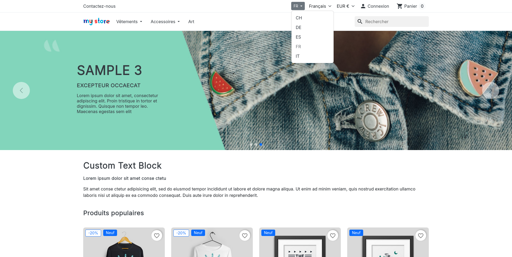
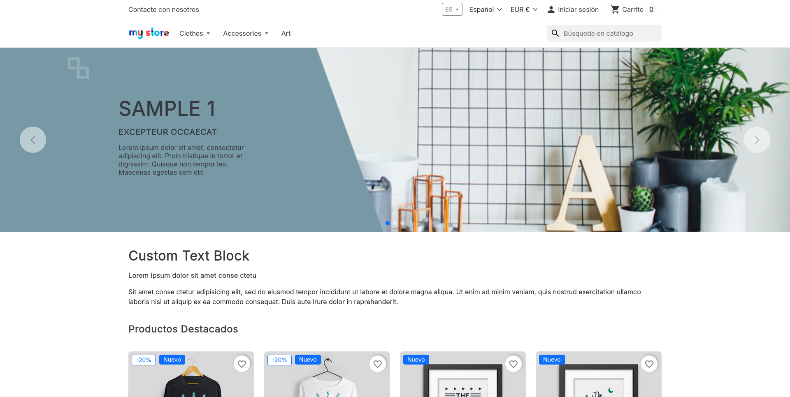

# PrestaShop Multistore Switcher

A simple, lightweight module that adds a store selector dropdown for PrestaShop multistore setups.

## Features
- Shows a dropdown of all active shops.
- Switch between stores with one click.
- No database changes.
- Free and open source.

## Screenshots




## Installation

### Option A) Manual installation
1. Upload the `multistoreswitcher` folder to your `/modules/` directory.
2. Go to Module Manager in your Back Office.
3. Search for "Multistore Switcher" and install it.
4. It will appear in the top navigation (via `displayNav2` hook). If you prefer, it can hooked to `displayFooter` too.

### Option B) Command line installation using >php8.1, packagist and composer

```
composer require jrosell/multistoreswitcher
```

## Compatibility
- Works on PrestaShop 9.
- Works with Hummingbird and classic themes.

## License
MIT